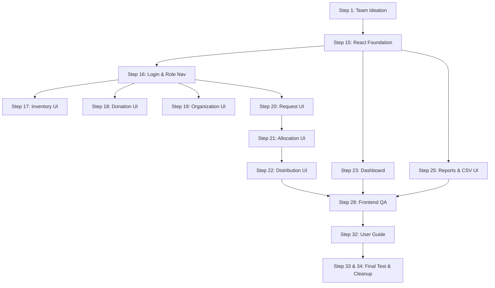

# Relfor Inventory & Donation Allocation System
## Aditya Singh — Working Skeleton & Master Execution Summary

> [!IMPORTANT]
> **Primary Owner:** Aditya Singh (Frontend, UI/UX, Dashboard, Frontend Integration)  
> **Total Planned Hours:** **~68 Hours** (~49 Hours Core UI Modules + 19 Hours Integration/QA)  
> **Workspace Directory:** `C:\Users\adity\.gemini\antigravity-ide\scratch\relfor-working-skeleton`

---

## 1. Overview of Aditya Singh's Workload & Prominent Role

In accordance with the **Relfor Execution Plan** (`RELFOR_EXECUTION_PLAN.md`), the project work is divided among 3 key team members:

| Member | Primary Ownership | Planned Effort |
| :--- | :--- | :---: |
| **Ansh** | Architecture, Allocation Engine, Backend Foundation, Deployment | ~62 hrs |
| **Aditya Singh (You)** | **Frontend UI/UX, Operational Dashboard, All User Interfaces, QA** | **~68 hrs** |
| **Aayush** | Database Schema, PostgreSQL, Auth API, Resource & Donation APIs, CSV Reports | ~66 hrs |

---

## 2. Breakdown of Aditya Singh's Assigned Steps & UI Modules

Aditya owns **15 specific steps** in the execution plan:

### Module Highlights & Acceptance Criteria:

1. **Step 15 — React Application Foundation (Phase 13)**
   - Setup React + Vite + Tailwind/Custom Design System + API client integration structure.
2. **Step 16 — Login & Role-Based Navigation (Phase 14)**
   - Auth portal supporting `ADMIN`, `STAFF`, and `NGO` roles with role-gated UI routing.
3. **Step 17 — Inventory Page UI (Phase 15)**
   - Filterable, searchable table displaying stock levels and badges (`AVAILABLE`, `LOW_STOCK`, `OUT_OF_STOCK`).
4. **Step 18 — Donation Interface (Phase 16)**
   - Form for recording incoming donations with instant transactional balance calculations (`Initial 100 + Donated 50 = 150`).
5. **Step 19 — Organization Directory (Phase 17)**
   - Beneficiary NGO profile directory and partner registration modal.
6. **Step 20 — Requirement Request Interface (Phase 18)**
   - Multi-item requirement request builder for NGOs with priority indicators (`NORMAL`, `HIGH`, `CRITICAL`).
7. **Step 21 — Allocation Engine Visualizer (Phase 19)**
   - Staff interface running Ansh's transactional allocation engine algorithm: `min(requested_qty, available_stock)`.
8. **Step 22 — Distribution Interface (Phase 20)**
   - Handover tracking form and signature receipt log.
9. **Step 23 — Operational Dashboard (Phase 21)**
   - Real-time KPI metrics, stock warning meters, and recent activity feeds.
10. **Step 25 — Reports & CSV Export UI (Phase 23)**
    - Dynamic report selector and standard CSV file generator.
11. **Step 32 — User Guide Documentation (Phase 29)**
    - End-user guide for non-technical foundation staff.

---

## 3. Working Skeleton Features Built in Scratch Workspace

The working skeleton application at `C:\Users\adity\.gemini\antigravity-ide\scratch\relfor-working-skeleton` includes:

- **Aditya Developer Execution Hub Banner**: Prominently highlights Aditya's ownership, step progress, team hours balance, and single-click step switcher.
- **Complete Interactive Component Suite**: Fully functional UI implementations of all 10 core views.
- **Reactive Mock State Machine**: Pre-configured with realistic inventory, donor, request, and allocation datasets allowing full offline testing.

> [!TIP]
> **Recommended Workspace Setting:**  
> Open `C:\Users\adity\.gemini\antigravity-ide\scratch\relfor-working-skeleton` as your active workspace in your IDE to directly view, modify, and run Aditya's code!
