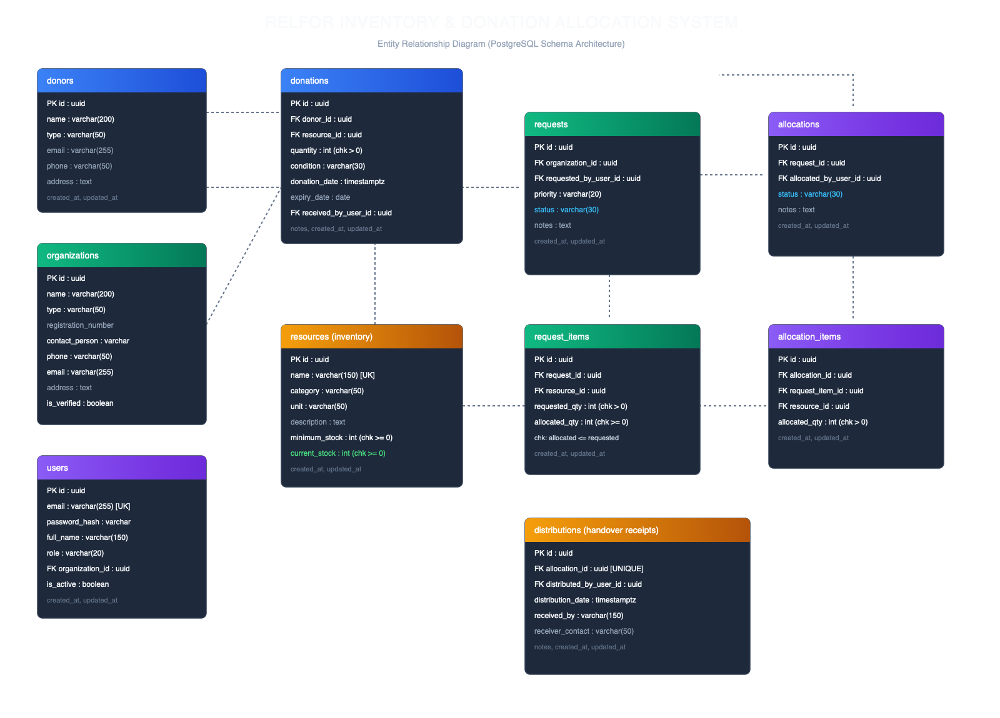
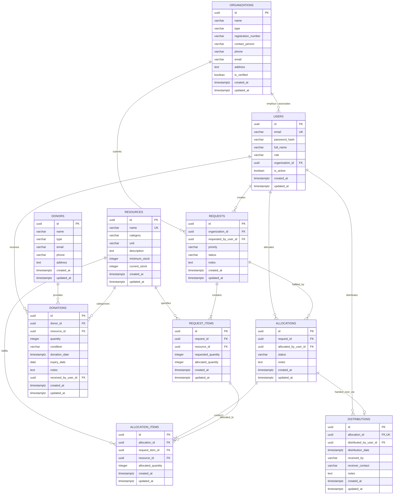

# Database Documentation

## 1. Overview & Architecture

The **Relfor Inventory & Donation Allocation System** uses **PostgreSQL (v14+)** as its primary relational database. The schema is designed to model the full relief lifecycle:

```text
Donation → Inventory → Requirement Request → Allocation → Distribution → History
```

The database enforces data integrity, ACID transactional consistency, and non-negative inventory via relational constraints, positive check constraints, and indexed foreign keys.

---

## 2. Entity Relationship Diagram (ERD)





---

## 3. Data Dictionary

### 3.1 `organizations`
Stores partner NGOs, orphanages, and relief organizations eligible to request assistance.

| Column | Type | Constraints | Default | Description |
|---|---|---|---|---|
| `id` | UUID | PRIMARY KEY | `gen_random_uuid()` | Unique organization identifier |
| `name` | VARCHAR(200) | NOT NULL | - | Legal / registered name |
| `type` | VARCHAR(50) | NOT NULL, CHECK | - | `NGO`, `SHELTER`, `ORPHANAGE`, `COMMUNITY_GROUP`, `DISASTER_RELIEF`, `OTHER` |
| `registration_number` | VARCHAR(100) | NULLABLE | - | Official registration or trust certificate number |
| `contact_person` | VARCHAR(150) | NOT NULL | - | Primary representative name |
| `phone` | VARCHAR(50) | NOT NULL | - | Contact telephone / mobile |
| `email` | VARCHAR(255) | NOT NULL | - | Official communication email |
| `address` | TEXT | NOT NULL | - | Physical location/office address |
| `is_verified` | BOOLEAN | NOT NULL | `TRUE` | Verification status by Foundation Admin |
| `created_at` | TIMESTAMPTZ | NOT NULL | `CURRENT_TIMESTAMP` | Record creation timestamp |
| `updated_at` | TIMESTAMPTZ | NOT NULL | `CURRENT_TIMESTAMP` | Last updated timestamp |

### 3.2 `users`
System accounts for authentication and authorization.

| Column | Type | Constraints | Default | Description |
|---|---|---|---|---|
| `id` | UUID | PRIMARY KEY | `gen_random_uuid()` | Unique user identifier |
| `email` | VARCHAR(255) | NOT NULL, UNIQUE | - | Login email address |
| `password_hash` | VARCHAR(255) | NOT NULL | - | Salted bcrypt hash |
| `full_name` | VARCHAR(150) | NOT NULL | - | Full name of the user |
| `role` | VARCHAR(20) | NOT NULL, CHECK | - | `ADMIN`, `STAFF`, `NGO` |
| `organization_id` | UUID | FK -> `organizations(id)` | NULL | Associated organization (required for NGO role) |
| `is_active` | BOOLEAN | NOT NULL | `TRUE` | Whether account is active |
| `created_at` | TIMESTAMPTZ | NOT NULL | `CURRENT_TIMESTAMP` | Record creation timestamp |
| `updated_at` | TIMESTAMPTZ | NOT NULL | `CURRENT_TIMESTAMP` | Last updated timestamp |

*Constraint:* `chk_ngo_user_org`: NGO role users must have a non-null `organization_id`.

### 3.3 `donors`
Entities providing donations.

| Column | Type | Constraints | Default | Description |
|---|---|---|---|---|
| `id` | UUID | PRIMARY KEY | `gen_random_uuid()` | Unique donor identifier |
| `name` | VARCHAR(200) | NOT NULL | - | Individual name or company name |
| `type` | VARCHAR(50) | NOT NULL, CHECK | - | `INDIVIDUAL`, `CORPORATE`, `FOUNDATION`, `GOVERNMENT`, `OTHER` |
| `email` | VARCHAR(255) | NULLABLE | - | Donor contact email |
| `phone` | VARCHAR(50) | NULLABLE | - | Donor contact phone |
| `address` | TEXT | NULLABLE | - | Donor billing/communication address |
| `created_at` | TIMESTAMPTZ | NOT NULL | `CURRENT_TIMESTAMP` | Record creation timestamp |
| `updated_at` | TIMESTAMPTZ | NOT NULL | `CURRENT_TIMESTAMP` | Last updated timestamp |

### 3.4 `resources`
Item master catalog and current inventory levels.

| Column | Type | Constraints | Default | Description |
|---|---|---|---|---|
| `id` | UUID | PRIMARY KEY | `gen_random_uuid()` | Unique resource identifier |
| `name` | VARCHAR(150) | NOT NULL, UNIQUE | - | Resource name (e.g. Rice, Blankets) |
| `category` | VARCHAR(50) | NOT NULL, CHECK | - | `FOOD`, `MEDICAL`, `CLOTHING`, `SHELTER`, `EDUCATION`, `HYGIENE`, `OTHER` |
| `unit` | VARCHAR(50) | NOT NULL | - | Unit of measurement (`kg`, `packets`, `boxes`, `pieces`, `sets`, `liters`) |
| `description` | TEXT | NULLABLE | - | Resource details and specifications |
| `minimum_stock` | INTEGER | NOT NULL, CHECK >= 0 | `0` | Reorder alert threshold |
| `current_stock` | INTEGER | NOT NULL, CHECK >= 0 | `0` | Real-time available warehouse quantity |
| `created_at` | TIMESTAMPTZ | NOT NULL | `CURRENT_TIMESTAMP` | Record creation timestamp |
| `updated_at` | TIMESTAMPTZ | NOT NULL | `CURRENT_TIMESTAMP` | Last updated timestamp |

### 3.5 `donations`
Logged donation entries from donors.

| Column | Type | Constraints | Default | Description |
|---|---|---|---|---|
| `id` | UUID | PRIMARY KEY | `gen_random_uuid()` | Unique donation ID |
| `donor_id` | UUID | NOT NULL, FK -> `donors(id)` | - | Source donor |
| `resource_id` | UUID | NOT NULL, FK -> `resources(id)` | - | Donated item |
| `quantity` | INTEGER | NOT NULL, CHECK > 0 | - | Number of units donated |
| `condition` | VARCHAR(30) | NOT NULL, CHECK | - | `NEW`, `GOOD`, `FAIR` |
| `donation_date` | TIMESTAMPTZ | NOT NULL | `CURRENT_TIMESTAMP` | Date donation received |
| `expiry_date` | DATE | NULLABLE | NULL | Expiry date for perishable items |
| `notes` | TEXT | NULLABLE | NULL | Donor remarks or delivery notes |
| `received_by_user_id` | UUID | FK -> `users(id)` | NULL | Staff member logging intake |
| `created_at` | TIMESTAMPTZ | NOT NULL | `CURRENT_TIMESTAMP` | Record creation timestamp |
| `updated_at` | TIMESTAMPTZ | NOT NULL | `CURRENT_TIMESTAMP` | Last updated timestamp |

### 3.6 `requests`
Requirement requests raised by beneficiary organizations.

| Column | Type | Constraints | Default | Description |
|---|---|---|---|---|
| `id` | UUID | PRIMARY KEY | `gen_random_uuid()` | Unique request ID |
| `organization_id` | UUID | NOT NULL, FK -> `organizations(id)` | - | Requesting organization |
| `requested_by_user_id` | UUID | NOT NULL, FK -> `users(id)` | - | Submitting user account |
| `priority` | VARCHAR(20) | NOT NULL, CHECK | `MEDIUM` | `LOW`, `MEDIUM`, `HIGH`, `URGENT` |
| `status` | VARCHAR(30) | NOT NULL, CHECK | `PENDING` | `PENDING`, `PARTIALLY_ALLOCATED`, `ALLOCATED`, `COMPLETED`, `REJECTED`, `CANCELLED` |
| `notes` | TEXT | NULLABLE | NULL | Justification, emergency context |
| `created_at` | TIMESTAMPTZ | NOT NULL | `CURRENT_TIMESTAMP` | Record creation timestamp |
| `updated_at` | TIMESTAMPTZ | NOT NULL | `CURRENT_TIMESTAMP` | Last updated timestamp |

### 3.7 `request_items`
Specific item demands under a request.

| Column | Type | Constraints | Default | Description |
|---|---|---|---|---|
| `id` | UUID | PRIMARY KEY | `gen_random_uuid()` | Unique line item ID |
| `request_id` | UUID | NOT NULL, FK -> `requests(id)` ON DELETE CASCADE | - | Parent request |
| `resource_id` | UUID | NOT NULL, FK -> `resources(id)` | - | Demanded resource |
| `requested_quantity` | INTEGER | NOT NULL, CHECK > 0 | - | Target quantity |
| `allocated_quantity` | INTEGER | NOT NULL, CHECK >= 0 | `0` | Fulfilled quantity so far |
| `created_at` | TIMESTAMPTZ | NOT NULL | `CURRENT_TIMESTAMP` | Record creation timestamp |
| `updated_at` | TIMESTAMPTZ | NOT NULL | `CURRENT_TIMESTAMP` | Last updated timestamp |

*Constraints:*
- `chk_allocated_le_requested`: `allocated_quantity <= requested_quantity`
- `uq_request_resource`: UNIQUE (`request_id`, `resource_id`)

### 3.8 `allocations`
Allocation decisions made by foundation staff.

| Column | Type | Constraints | Default | Description |
|---|---|---|---|---|
| `id` | UUID | PRIMARY KEY | `gen_random_uuid()` | Unique allocation ID |
| `request_id` | UUID | NOT NULL, FK -> `requests(id)` | - | Target request fulfilled |
| `allocated_by_user_id` | UUID | NOT NULL, FK -> `users(id)` | - | Staff member who approved allocation |
| `status` | VARCHAR(30) | NOT NULL, CHECK | `PENDING_DISTRIBUTION` | `PENDING_DISTRIBUTION`, `DISTRIBUTED`, `CANCELLED` |
| `notes` | TEXT | NULLABLE | NULL | Internal dispatch/approval notes |
| `created_at` | TIMESTAMPTZ | NOT NULL | `CURRENT_TIMESTAMP` | Record creation timestamp |
| `updated_at` | TIMESTAMPTZ | NOT NULL | `CURRENT_TIMESTAMP` | Last updated timestamp |

### 3.9 `allocation_items`
Detailed resource quantities assigned to each request item.

| Column | Type | Constraints | Default | Description |
|---|---|---|---|---|
| `id` | UUID | PRIMARY KEY | `gen_random_uuid()` | Unique line allocation ID |
| `allocation_id` | UUID | NOT NULL, FK -> `allocations(id)` ON DELETE CASCADE | - | Parent allocation batch |
| `request_item_id` | UUID | NOT NULL, FK -> `request_items(id)` | - | Matched demand line |
| `resource_id` | UUID | NOT NULL, FK -> `resources(id)` | - | Resource deducted from inventory |
| `allocated_quantity` | INTEGER | NOT NULL, CHECK > 0 | - | Quantity reserved from stock |
| `created_at` | TIMESTAMPTZ | NOT NULL | `CURRENT_TIMESTAMP` | Record creation timestamp |
| `updated_at` | TIMESTAMPTZ | NOT NULL | `CURRENT_TIMESTAMP` | Last updated timestamp |

*Constraint:* `uq_allocation_request_item`: UNIQUE (`allocation_id`, `request_item_id`)

### 3.10 `distributions`
Proof and timestamp of physical handover.

| Column | Type | Constraints | Default | Description |
|---|---|---|---|---|
| `id` | UUID | PRIMARY KEY | `gen_random_uuid()` | Unique distribution receipt ID |
| `allocation_id` | UUID | NOT NULL, UNIQUE, FK -> `allocations(id)` | - | One-to-one link to allocation |
| `distributed_by_user_id` | UUID | NOT NULL, FK -> `users(id)` | - | Staff supervising dispatch |
| `distribution_date` | TIMESTAMPTZ | NOT NULL | `CURRENT_TIMESTAMP` | Handover timestamp |
| `received_by` | VARCHAR(150) | NOT NULL | - | NGO representative name |
| `receiver_contact` | VARCHAR(50) | NULLABLE | - | Receiver phone/ID verification |
| `notes` | TEXT | NULLABLE | NULL | Handover location, receipt reference |
| `created_at` | TIMESTAMPTZ | NOT NULL | `CURRENT_TIMESTAMP` | Record creation timestamp |
| `updated_at` | TIMESTAMPTZ | NOT NULL | `CURRENT_TIMESTAMP` | Last updated timestamp |

---

## 4. Integrity Constraints & Business Rules

1. **Non-Negative Inventory**: `resources.current_stock >= 0` ensures the database strictly prevents negative inventory.
2. **Allocation Ceilings**: `request_items.allocated_quantity <= request_items.requested_quantity` guarantees over-allocation cannot occur.
3. **Audit Trail**: Every operational transaction retains foreign keys to the originating user (`received_by_user_id`, `requested_by_user_id`, `allocated_by_user_id`, `distributed_by_user_id`).
4. **Referential Deletes**:
   - Master entities (`organizations`, `resources`, `donors`, `users`) use `RESTRICT` to prevent accidental loss of operational history.
   - Child line items (`request_items`, `allocation_items`) cascade on parent container deletion.
5. **Distribution Uniqueness**: `allocation_id` in `distributions` is unique, guaranteeing an allocation can only ever be distributed once.

---

## 5. Indexing Strategy

B-tree indexes are established on:
- High-frequency lookup columns: `users(email)`, `resources(name)`, `organizations(name)`.
- Foreign key columns across all tables to optimize relational joins.
- Filter and status columns: `requests(status, priority)`, `resources(category)`, `allocations(status)`.
- Temporal columns: `donations(donation_date)`, `requests(created_at)`, `distributions(distribution_date)`.
