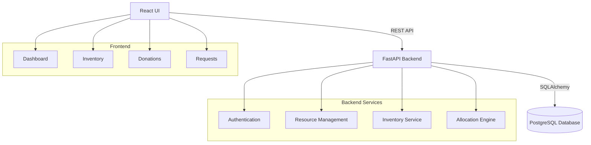

# System Architecture

## High-Level System Architecture

## Component Responsibilities

### Frontend (React + Vite + Tailwind CSS)
- Provides a clean, responsive UI for Admin, Staff, and NGOs.
- Handles user interactions, form submissions, and data visualization.

### Backend (Python + FastAPI)
- Exposes RESTful endpoints for frontend consumption.
- Implements core business logic, validation, and role-based access control.
- **Allocation Engine**: Handles the transactional logic of deducting inventory and fulfilling requests (including partial fulfillment rules).

### Database (PostgreSQL)
- Relational data storage for Users, Donors, Resources, Inventory, Requests, and Allocations.
- Enforces data integrity (e.g., constraints to prevent negative inventory).
