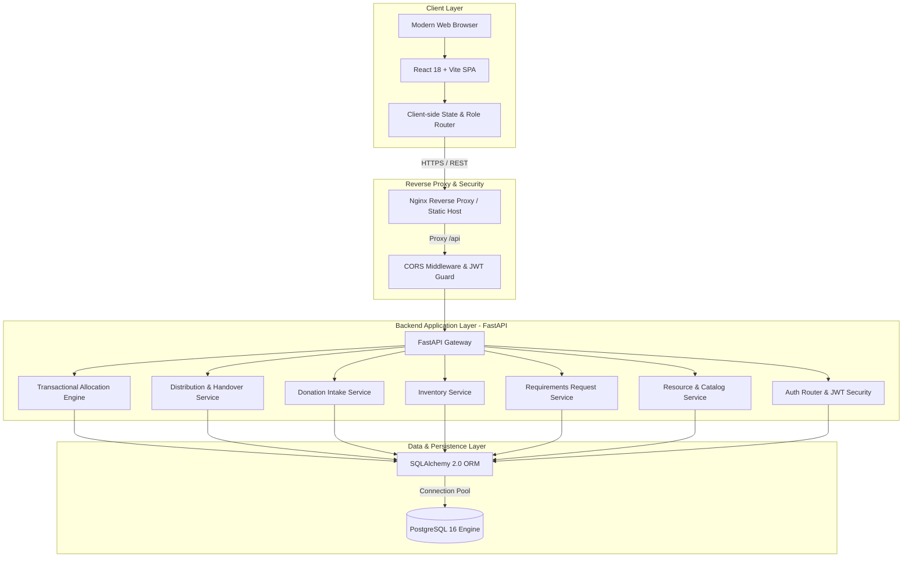

# System Architecture & Technical Specifications

This document outlines the production architecture, module responsibilities, security boundaries, and database interaction model of the **Relfor Inventory & Donation Allocation System**.

---

## 1. High-Level System Architecture

The application follows a modular 3-tier client-server architecture designed for reliability, strict data invariants, and transaction integrity:

```mermaid
graph TD
    subgraph Client Layer
        Browser[Modern Web Browser]
        UI[React 18 + Vite SPA]
        Router[Client-side State & Role Router]
        Browser --> UI
        UI --> Router
    end

    subgraph Reverse Proxy & Security
        Nginx[Nginx Reverse Proxy / Static Host]
        CORS[CORS Middleware & JWT Guard]
        Router -->|HTTPS / REST| Nginx
        Nginx -->|Proxy /api| CORS
    end

    subgraph Backend Application Layer - FastAPI
        API[FastAPI Gateway]
        CORS --> API

        Auth[Auth Router & JWT Security]
        ResMgmt[Resource & Catalog Service]
        InvSvc[Inventory Service]
        DonSvc[Donation Intake Service]
        ReqSvc[Requirements Request Service]
        AllocEng[Transactional Allocation Engine]
        DistSvc[Distribution & Handover Service]

        API --> Auth
        API --> ResMgmt
        API --> InvSvc
        API --> DonSvc
        API --> ReqSvc
        API --> AllocEng
        API --> DistSvc
    end

    subgraph Data & Persistence Layer
        ORM[SQLAlchemy 2.0 ORM]
        DB[(PostgreSQL 16 Engine)]

        AllocEng --> ORM
        DistSvc --> ORM
        DonSvc --> ORM
        InvSvc --> ORM
        ReqSvc --> ORM
        ResMgmt --> ORM
        Auth --> ORM

        ORM -->|Connection Pool| DB
    end
```

---

## 2. Component Responsibilities

### Frontend Layer (`src/`)
* **Framework:** React 18, Vite 5, Tailwind CSS / Vanilla Utility Styling.
* **Component Views:**
  * `AuthView`: JWT authentication, role selection (Admin, Staff, NGO), and session persistence.
  * `InventoryView`: Real-time catalog and warehouse availability with status tags (`AVAILABLE`, `LOW_STOCK`, `OUT_OF_STOCK`).
  * `DonationView`: Intake form logging donor details, resource categories, and quantities.
  * `RequestView`: NGO requirement submissions and priority classification (`LOW`, `MEDIUM`, `HIGH`, `URGENT`).
  * `AllocationView`: Visualizer for staff to review pending requests and execute allocations.
  * `DistributionView`: Physical handover receipts and proof-of-delivery logging.
  * `Dashboard`: High-level operational metrics, stock health alerts, and summary charts.
  * `ReportsView`: CSV export and audit trail filtering.

### Backend Application Layer (`backend/app/`)
* **Framework:** FastAPI with Python 3.11/3.13, Uvicorn ASGI server.
* **Core Modules:**
  * **Authentication (`app/core/security.py`, `app/routers/auth.py`):** Bcrypt password hashing (`cost=12`), signed JWT access tokens with 120-minute expiry, and role-based route dependencies (`require_staff_or_admin`, `get_current_user`).
  * **Allocation Engine (`app/services/allocation_service.py`):** Atomic pre-validation of multi-item batches, stock deduction, and automatic status transition (`PENDING` -> `PARTIALLY_ALLOCATED` -> `ALLOCATED`).
  * **Distribution Service (`app/services/distribution_service.py`):** Verifies allocation readiness, records recipient and contact data, and finalizes request status to `COMPLETED`.
  * **Inventory Service (`app/services/inventory_service.py`):** Calculates stock health relative to `minimum_stock` and guarantees non-negative inventory exposure.
  * **Global Exception Handling (`app/core/errors.py`):** Intercepts database constraint violations, integrity errors, and validation exceptions, returning standardized JSON error payloads.

### Persistence Layer (`database/`)
* **RDBMS:** PostgreSQL 16.
* **Data Invariants Enforced at DB Level:**
  * `resources.current_stock >= 0` check constraint.
  * `resources.minimum_stock >= 0` check constraint.
  * `donations.quantity > 0` check constraint.
  * `request_items.allocated_quantity <= requested_quantity`.
  * Referential integrity with foreign keys and cascade delete restrictions.
  * Automatic `updated_at` timestamp triggers across all tables.

---

## 3. Data Flow & Transaction Lifecycle

1. **Intake Flow:** Donor delivers relief materials -> Staff logs donation -> Database trigger updates `resources.current_stock` -> Real-time inventory reflects increment.
2. **Request Flow:** Registered NGO submits request specifying resources and quantities -> Stored as `PENDING`.
3. **Allocation Flow (Atomic Transaction):**
   * Staff initiates allocation against request.
   * System verifies that each item's allocation is within remaining needed quantity.
   * System checks warehouse current stock.
   * If any item is unavailable or invalid, the entire transaction rolls back cleanly.
   * On success: Stock is deducted, allocation records are created, and request transitions to `ALLOCATED` or `PARTIALLY_ALLOCATED`.
4. **Distribution Flow:**
   * Ground staff hands over goods to authorized recipient.
   * Distribution record logged with contact details.
   * Allocation marks `DISTRIBUTED`. Once all items for a request are distributed, request transitions to `COMPLETED`.
